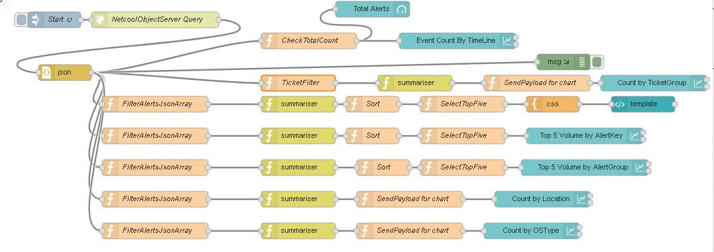

# netcool-NodeRed-Dashboard

Apart from webgui widgets for those who need realtime monitoring of aggregation data can use this dashboard.

Advantages:- 
- Economic solution to alert data visualization.
- Dashboard serves as key for identifying anomalies 
- Provides insight on real-time alert data
- Portable to multiple platforms
- Easy to deploy at IBM Bluemix node-r

