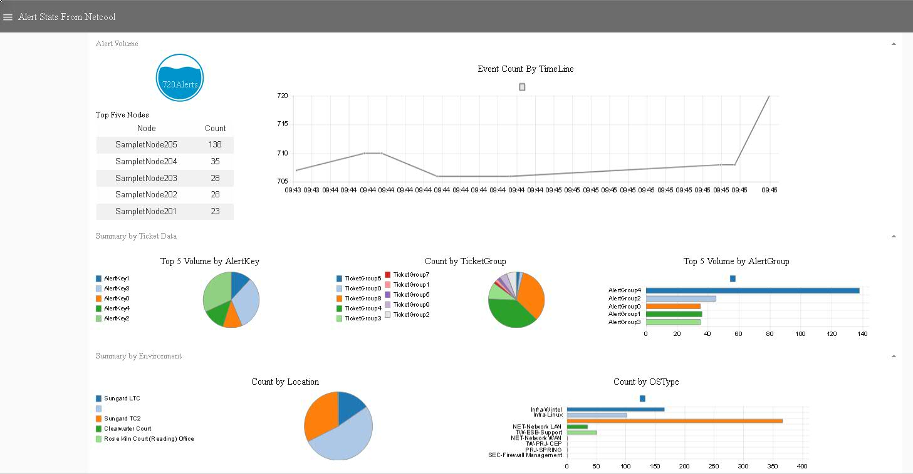

# netcool-NodeRed-Dashboard

Apart from webgui widgets for those who need realtime monitoring of aggregation data can use this dashboard.

Advantages:- 
- Economic solution to alert data visualization.
- Dashboard serves as key for identifying anomalies 
- Provides insight on real-time alert data
- Portable to multiple platforms
- Easy to deploy at IBM Bluemix node-r

Dashboard :
----------
 

## Implementation Steps:

### Step 1:Enable Http Interface at Object server
- To enable the interfaces, set the NRestOS.Enable property to TRUE.
- To configure the embedded HTTP server so that the interfaces are active on an HTTP port, specify the listening port for the connection type. For example, to make the interfaces listen on port 8080, set the properties as follows:

```
NHttpd.EnableHTTP : TRUE
NHttpd.ListeningPort : 8080

```
- If you want the interfaces to be active on an HTTPS port on 9090, set the properties that are shown in the following example. Because an HTTPS port is SSL encrypted, a certificate file that contains an appropriate certificate needs to be created and protected by a password.
```
NHttpd.SSLEnable : TRUE
NHttpd.SSLListeningPort : 9090
NHttpd.SSLCertificate : “certificatelabel”
NHttpd.SSLCertificatePwd : “password”

```

Flow post import on node-red flow editor :
-----------------------------------------

